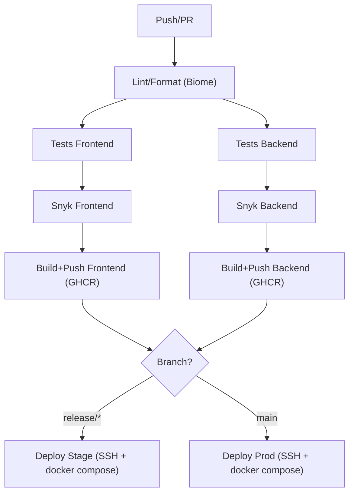

# Club Poisson

Projet monorepo avec un backend Bun/TypeScript, un frontend React/Vite, et une base de donnée PostgreSQL.

## Prerequis

- Bun
- Docker + Docker Compose
- Git

## Lancer en Docker (stack complete)

```bash
docker compose up --build
```

Points d'accès utiles en local :

- App (via reverse proxy): `http://localhost`
- Backend direct: `http://localhost:3000`
- Adminer: `http://localhost:8080`
- Grafana: `http://localhost:3001`
- Prometheus: `http://localhost:9090`
- Loki: `http://localhost:3100`
- cAdvisor: `http://localhost:8081`
- Node Exporter: `http://localhost:9100`

## Architecture CI/CD

Workflow GitHub Actions: [.github/workflows/github-ci.yml](.github/workflows/github-ci.yml)

Déclencheurs :

- Pull request vers `dev`, `main`, ou `release/*`
- Push sur `main` et `release/*`

Etapes principales :

1. **Lint/format** via Biome (`bun run ci`) à la racine.
2. **Tests** avec `bun test` sur le frontend et le backend.
3. **Securité** avec Snyk (frontend et backend).
4. **Build & push images** vers GHCR avec Buildx + cache (tags SHA courts).
5. **Deploiement staging** (branche `release/*`) : copie de [docker-compose-stage.yml](docker-compose-stage.yml) et `infra/`, puis `docker compose up -d` par SSH.
6. **Deploiement production** (branche `main`) : copie de [docker-compose-server.yml](docker-compose-server.yml) et `infra/`, puis `docker compose up -d` par SSH.

Schema (simplifié) :



Secrets utilisés (exemples) : `SNYK_TOKEN`, `SSH_HOST`, `SSH_USER`, `SSH_KEY`, `POSTGRES_*`, `GRAFANA_*`, `LETSENCRYPT_PATH`.

## Choix techniques (et pourquoi)

- **Nginx reverse proxy** pour servir le frontend et router `/api` vers le backend.
- **GitHub Actions + GHCR** pour une CI/CD integrée et un registre privé.
- **Monitoring/Logging** avec Prometheus, Grafana, Loki, Promtail, cAdvisor, Node Exporter.

## Bonus implementés

- Reverse proxy Nginx en dev/stage/prod
- HTTPS en stage/prod via certificats (LetsEncrypt)
- Healthchecks Docker sur les services critiques
- Monitoring et logging centralisés (Grafana + Prometheus + Loki)
- Build cache Docker (Buildx cache) dans la CI
- Environnement de staging separé via [docker-compose-stage.yml](docker-compose-stage.yml)
- Scan de vulnerabilités Snyk dans la CI
