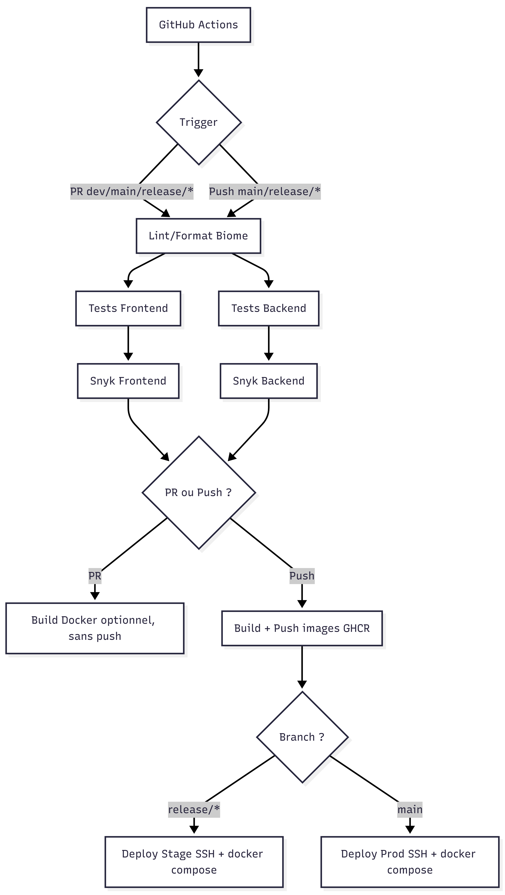

# Club Poisson

Projet monorepo avec un backend Bun/TypeScript, un frontend React/Vite, et une base de donnée PostgreSQL.

## Prerequis

- Bun
- Docker + Docker Compose
- Git

## Commandes utiles

```bash
# Lint/format (à la racine)
bun install
bun run ci

# Tests
cd backend && bun install && bun test
cd frontend && bun install && bun test
```

## Lancer en local (développement)

1) Démarrer PostgreSQL (exemple)

```bash
docker run -d --name clubpoisson-db \
  -e POSTGRES_USER=clubpoisson \
  -e POSTGRES_PASSWORD=clubpoisson \
  -e POSTGRES_DB=clubpoisson \
  -p 5432:5432 \
  postgres:17
```

2) Backend (port 3000)

```bash
cd backend
bun install
PGHOST=localhost PGDATABASE=clubpoisson PGUSER=clubpoisson PGPASSWORD=clubpoisson bun dev
```

3) Frontend (port 5173)

```bash
cd frontend
bun install
bun dev
```

## Lancer en local (Docker)

```bash
docker compose up --build
```

Points d'accès utiles en local :

- App (via reverse proxy): `http://localhost`
- Backend direct: `http://localhost:3000`
- Adminer: `http://localhost:8080`
- Grafana: `http://localhost:3001`
- Prometheus: `http://localhost:9090`
- Loki: `http://localhost:3100`
- cAdvisor: `http://localhost:8081`
- Node Exporter: `http://localhost:9100`

Note : le mot de passe admin est `ADMIN_PASSWORD` (par défaut : `admin` mais juste pour le docker compose local sinon sur stage et prod, c'est complètement sécurisé).

## Architecture CI/CD

Workflow GitHub Actions: [.github/workflows/github-ci.yml](.github/workflows/github-ci.yml)

Déclencheurs :

- Pull request vers `dev`, `main`, ou `release/*`
- Push sur `main` et `release/*`

Etapes principales :


1. **Lint/format** via Biome (`bun run ci`) à la racine.
2. **Tests** avec `bun test` sur le frontend et le backend.
3. **Securité** avec Snyk (frontend et backend).
4. **Build & push images** vers GHCR avec Buildx + cache (tags SHA courts).
5. **Deploiement staging** (branche `release/*`) : copie de [docker-compose-stage.yml](docker-compose-stage.yml) et `infra/`, puis `docker compose up -d` par SSH.
6. **Deploiement production** (branche `main`) : copie de [docker-compose-server.yml](docker-compose-server.yml) et `infra/`, puis `docker compose up -d` par SSH.

Schema (simplifié) :



Secrets utilisés : `SNYK_TOKEN`, `SSH_HOST`, `SSH_USER`, `SSH_KEY`, `STAGE_SSH_HOST`, `STAGE_SSH_USER`, `STAGE_SSH_KEY`, `POSTGRES_DB`, `POSTGRES_USER`, `POSTGRES_PASSWORD`, `GRAFANA_ADMIN_USER`, `GRAFANA_ADMIN_PASSWORD`, `LETSENCRYPT_PATH`.

## Étapes 1 → 6 (SUJET.md)

### 1) Tests

- Objectif : sécuriser les parties critiques (auth, routes, logique events) sans dépendre d’une vraie DB.
- **Backend** : tests unitaires avec `bun:test`, en mockant les dépendances (repository, guard).
  - Dossier : `backend/src/tests/units/`
  - Exemples : routes events (GET/POST/PUT/DELETE), guard, sessions.
  - Commande : `cd backend && bun test`
- **Frontend** : tests unitaires (API layer) avec `bun:test` en mockant `fetch` et `localStorage`.
  - Fichier : `frontend/src/api/events.test.ts`
  - Commande : `cd frontend && bun test`

### 2) Linting / formatage

- Objectif : un style cohérent + CI qui échoue si le code n’est pas clean.
- **Biome** à la racine pour uniformiser lint + format (monorepo).
  - Commandes :
    - `bun run ci` (CI : vérifie format + lint)
    - `bun run format` (réécrit le format)
    - `bun run lint` (lint)
- Bonus qualité dev : pre-commit Husky + lint-staged (auto-check sur fichiers modifiés).

### 3) Intégration continue (CI)

- Objectif : exécuter automatiquement la qualité à chaque PR + automatiser build/deploy sur merge.
- Workflow : [.github/workflows/github-ci.yml](.github/workflows/github-ci.yml)
- Déclencheurs (résumé) :
  - PR vers `dev`, `main`, `release/*` → qualité (lint/tests/snyk), pas de déploiement.
  - Push sur `main` → build/push images + deploy prod.
  - Push sur `release/*` → build/push images + deploy stage.
- Optimisations : cache Bun (install) + cache Docker Buildx + filtres `paths`.

### 4) Conteneurisation

- Objectif : lancer l’app complète via `docker compose up` (local) et déployer la même stack sur serveur.
- Dockerfiles : `backend/Dockerfile`, `frontend/Dockerfile`
- Compose :
  - Local : [docker-compose.yml](docker-compose.yml)
    - Postgres + backend + frontend + reverse proxy Nginx
    - Monitoring/logging (Grafana/Prometheus/Loki/Promtail + exporters)
    - Healthchecks pour fiabiliser l’orchestration
  - Prod : [docker-compose-server.yml](docker-compose-server.yml)
    - Pull des images depuis GHCR (tag `${IMAGE_TAG}`)
    - Nginx avec TLS (certificats montés via `LETSENCRYPT_PATH`)
  - Stage : [docker-compose-stage.yml](docker-compose-stage.yml)
    - Pull des images depuis GHCR (tag `${IMAGE_TAG}`)
    - Ports dédiés stage, avec frontend/backend bind sur `127.0.0.1` (accès via Nginx hôte)

### 5) Build automatisé des images

- Objectif : générer des images immuables et traçables à chaque merge.
- Build Docker via Buildx + cache et push sur **GHCR** sur `push` de `main` et `release/*`.
- Tags : SHA court du commit (via docker/metadata-action) → même tag utilisé pour backend + frontend.
- Sur PR : build possible (sans push) pour valider que les Dockerfiles buildent.

### 6) Déploiement automatisé

- Objectif : déploiement automatique après merge, sans intervention manuelle.
- Déploiement par SSH depuis GitHub Actions :
  - `main` → **prod** : copie `docker-compose-server.yml` + `infra/`, puis `docker compose up -d`.
  - `release/*` → **stage** : copie `docker-compose-stage.yml` + `infra/`, puis `docker compose up -d`.
- Gestion des secrets : SSH (prod vs stage) + variables DB + identifiants Grafana + `LETSENCRYPT_PATH` (prod).
- Reverse proxy / HTTPS :
  - Prod : Nginx dans le compose avec [infra/nginx/nginx.prod.conf](infra/nginx/nginx.prod.conf)
  - Stage : Nginx sur la machine hôte avec [infra/nginx/nginx.stage.conf](infra/nginx/nginx.stage.conf)

## Choix techniques (et pourquoi)


- **Biome (lint/format)** : un outil unique pour uniformiser le style et éviter les divergences entre packages.
  - Scripts à la racine : [package.json](package.json)
  - Config : [biome.json](biome.json)

- **Docker + Compose** : reproductible en local et sur serveur (mêmes services, mêmes healthchecks).
  - Local : [docker-compose.yml](docker-compose.yml)
  - Prod : [docker-compose-server.yml](docker-compose-server.yml)
  - Stage : [docker-compose-stage.yml](docker-compose-stage.yml)

- **Reverse proxy Nginx** : sert le frontend et route `/api/` vers le backend sur le même domaine (meilleure UX, config simple).
  - Prod : [infra/nginx/nginx.prod.conf](infra/nginx/nginx.prod.conf)
  - Stage (Nginx hôte) : [infra/nginx/nginx.stage.conf](infra/nginx/nginx.stage.conf)

- **GitHub Actions + GHCR** : CI/CD intégrée GitHub + registry d’images au même endroit (permissions simples, traçabilité).
  - Pipeline : [.github/workflows/github-ci.yml](.github/workflows/github-ci.yml)
  - Tags d’images : SHA court (reproductible et traçable)

- **Déploiement par SSH + docker compose** : pas d’orchestrateur complexe, déploiement compréhensible et démontrable.
  - Push `release/*` → stage ; push `main` → prod

- **Monitoring / logging** : stack standard et “démo-friendly” (Grafana pour dashboards, Prometheus pour métriques, Loki/Promtail pour logs).
  - Configs : [infra/monitoring](infra/monitoring)

- **Sécurité / maintenance** :
  - **Snyk** en CI pour détecter des vulnérabilités de dépendances.
  - **Dependabot** pour proposer des mises à jour automatiques : [.github/dependabot.yml](.github/dependabot.yml)
  - **Pre-commit** (Husky + lint-staged) pour éviter de commit du code mal formaté : [.husky/pre-commit](.husky/pre-commit)

## Bonus implementés

- Reverse proxy Nginx en dev/stage/prod
- HTTPS en stage/prod via certificats (LetsEncrypt)
  - prod: https://groupe4.galyson.com (mais malheureusement le server EC2 est down)
  - stage: https://dev.galyson.com (VPS Hostinger)
- Healthchecks Docker sur les services critiques
- Monitoring et logging centralisés (Grafana + Prometheus + Loki + cAdvisor + Node Exporter)
- Build cache Docker (Buildx cache) dans la CI
- Environnement de staging separé via [docker-compose-stage.yml](docker-compose-stage.yml)
- Scan de vulnerabilités Snyk dans la CI
- Hooks **pre-commit** (Husky + lint-staged + Biome)
- MAJ auto des dépendances (Dependabot)

## Autres bonus
- Let’s Encrypt, à cause de leur politique, ne nous a pas fourni de certificat pour une instance EC2 temporaire ; c’est pourquoi nous sommes passés par un sous-domaine Hostinger (goupe4.galyson.com et dev.galyson.com).
- Stratégie de branches proche GitFlow : `dev` → `release/*` → `main` (stage puis prod)
- Séparation des environnements : compose dédié prod/stage + secrets SSH dédiés (`STAGE_*` vs prod)
- Stage plus “safe” : frontend/backend exposés en `127.0.0.1` (accès via Nginx hôte)
- Principe du moindre privilège : plusieurs services ne sont pas exposés publiquement (accès via proxy/Grafana)
- CI optimisée : filtres `paths` (pipeline déclenché seulement si fichiers pertinents changent)
- CI plus rapide : cache Bun (dépendances) + cache Docker Buildx
- Monitoring par environnement : configs dédiées dev/prod (Prometheus/Promtail)
- Logs Docker plus lisibles : tags structurés via driver `json-file` dans les compose
- Config Nginx versionnée : fichiers dev/prod/stage dans `infra/nginx/`
